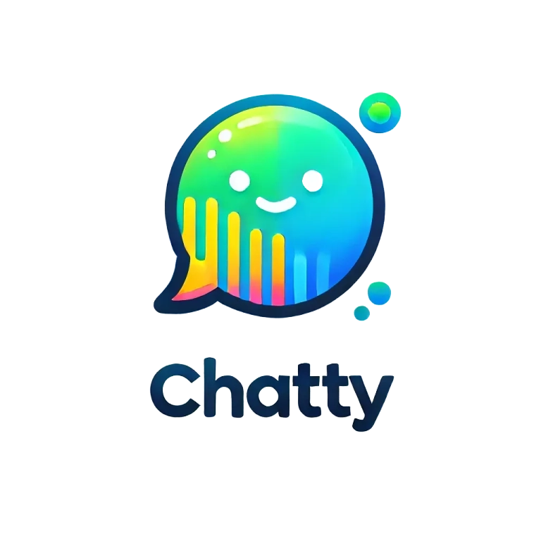

# Chatty

A modern, fast, and secure chat application built with React, Nest.js, and Socket.io. Chatty provides a seamless real-time communication experience with features like one-on-one messaging, group channels, friend management, and more.



## Features

- **Real-time Communication**: Instant messaging using Socket.io
- **User Management**:
  - User authentication and authorization
  - Profile customization with image upload
  - Friend requests and management
  - User blocking capabilities
- **Messaging Features**:
  - One-on-one private messaging
  - Group channels with multiple participants
  - Image sharing in messages
  - Message deletion
  - Read status and timestamps
- **Channel Management**:
  - Create and edit channels
  - Add/remove participants
  - Channel admin privileges
  - Channel image and description
- **Modern UI/UX**:
  - Responsive design
  - Dark theme
  - Image lazy loading
  - Real-time updates
  - Message status indicators

## Tech Stack

- **Frontend**:

  - React
  - Redux Toolkit (State Management)
  - Socket.io Client
  - Tailwind CSS
  - React Router
  - Axios
  - React Icons
  - React Lazy Load Image Component
  - Moment.js
  - js-cookie

- **Image Storage**:
  - Cloudinary

## Prerequisites

Before running the application, make sure you have:

- Node.js (v14 or higher)
- npm or yarn
- A Cloudinary account for image storage

## Setup Instructions

1. **Clone the repository**

   ```bash
   git clone <repository-url>
   cd chatty
   ```

2. **Install dependencies**

   ```bash
   npm install
   # or
   yarn install
   ```

3. **Environment Configuration**

   - Copy `.env.example` to `.env`

   ```bash
   cp .env.example .env
   ```

   - Update the environment variables in `.env`:
     - `REACT_APP_API_BASE_URL`: Your backend API URL
     - `REACT_APP_CLOUD_NAME`: Your Cloudinary cloud name
     - `REACT_APP_UPLOAD_PRESET`: Your Cloudinary upload preset

4. **Start the development server**
   ```bash
   npm start
   # or
   yarn start
   ```

## Project Structure

```
src/
├── assets/          # Static assets
├── components/      # Reusable components
├── hooks/           # Custom React hooks
├── lib/            # Library configurations
├── pages/          # Application pages/routes
├── redux/          # Redux store and slices
├── services/       # API service functions
└── utils/          # Utility functions
```

## Key Features Explained

### Authentication

- JWT-based authentication
- Secure token storage using cookies
- Protected routes and API endpoints

### Real-time Communication

- Socket.io integration for instant messaging
- Real-time updates for:
  - New messages
  - Channel updates
  - Friend requests
  - User status

### User Management

- Profile customization with image upload
- Friend system with request/accept/reject functionality
- User blocking for privacy control
- User search functionality

### Channels

- Create private or group channels
- Channel customization (name, description, image)
- Participant management
- Admin privileges
- Leave channel functionality

### Messages

- Text and image messages
- Message deletion
- Timestamp display
- Read status
- Message history

## Contributing

Contributions are welcome! Please feel free to submit a Pull Request.

## License

This project is licensed under the GNU General Public License (GPL) - see the LICENSE file for details.
